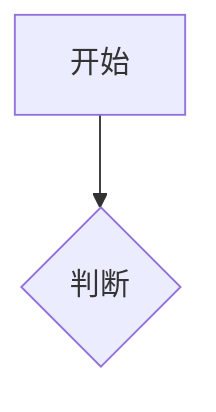

# 写作语法（GRAMMAR）

正文写法与写作规范的**唯一来源**：改语法只改本文件，其他文档用链接指过来。

- 实现、样式与陷阱（脚本、CSS 类名、ink.js 模块）见 [THEME.md](THEME.md)。
- 构建、提交、发布流程见 [WORKFLOW.md](WORKFLOW.md)。
- 拍板排除、不要实现的功能见 [EXCLUDED.md](EXCLUDED.md)。

## 写作规范

新文章：在 `source/_posts/` 建 `xxx.md`，front-matter 格式：

```yaml
---
title: 文章标题
date: 2026-08-08 14:00:00     # 决定 URL 与排序（:year/:month/:day/:title/）
excerpt: 一句话摘要           # 首页摘要：一律手写（见下方说明，不用 <!-- more -->）
tags:
  - 标签1
categories:
  - 分类1
comments: true                 # 默认开评论；不需要则 false
cover: /img/360px/covers/xxx.jpg  # 可选：封面（页面展示 360px；og:image 自动改写为 ori）
pinned: true                   # 可选：置顶到首页最前（不写则按日期排序）
updated: 2026-08-18 10:00:00   # 可选：更新日期（显式写才在文章页显示"更新于"；
                               #   Hexo 默认 updated 是文件 mtime，git checkout
                               #   会刷新，勿依赖隐式值，不写则不显示）
math: true                     # 可选：强制加载 MathJax；false 强制不加载；缺省自动检测
---
```

要点：

- **文件名一律英文 kebab-case**（小写+连字符，如 `time-management-master.md`）：
  文件名即 URL slug（permalink `:year/:month/:day/:title/`），中文名会产出
  百分号编码的长 URL。中文标题写进 front-matter `title` 即可；改文件名会变
  URL，需同步在 `scripts/redirects.js` 加 301。
- **excerpt 一律 front matter 手写**（`excerpt: 一句话摘要`）：不要用
  `<!-- more -->` 自然截断——截断点可能落在代码中间，导致摘要里出现
  HTML 实体乱码，且截断摘要只是开头段复制，不是真正的摘要。
- **date 即永久链接**：发文后改日期会改变 URL，造成死链。定稿后再定日期。
- **图片引用**：正文与 cover 一律写 `/img/360px/...`（展示图由构建生成，勿提交
  `source/img/360px/`）；原图放 `source/img/ori/` 入库。灯箱左上角「查看原图」
  自动指向对应 `/img/ori/...`。`icon.svg` 不进双轨。
- **中英文空格**：写作时手动在中文与英文/数字间加空格（不做自动 pangu，
  原因见 [THEME.md → 中英文空格](THEME.md#中英文空格)）。
- 文章会自动进 feed（atom.xml，限 20 篇）、搜索（search.xml）与 sitemap，
  无需额外操作。

## 提示块（:::admon）

五类彩色块，类型在方括号首词指定：

```markdown
:::admon[note]
内容，支持 **Markdown** 与代码块
:::

:::admon[tip 自定义标题]
内容
:::
```

类型：`note` / `tip` / `important` / `warning` / `caution`（不区分大小写）；
类型后文本作标题，省略时显示类型名。方括号可整体省略（等价于 `[note]`）；
首词不是类型时整块按 `note` 渲染、全串作标题（如 `:::admon[注意]`）。
未闭合的 `:::` 会原样输出为文本（写错时显眼暴露）。
样式与图标见 [THEME.md → 提示块](THEME.md#提示块admonitions)。

## Mermaid 图表

````markdown

````

仅含图表的页面按需加载 mermaid.min.js（约 1MB gzip），无图表页面零开销。
图表跟随深浅主题。**限制**：列表/引用缩进内的 mermaid 围栏不支持（会被
Hexo 代码块预处理接管走代码高亮），图表一律顶格写。

## 卡片（::card）

**GitHub 仓库卡片**：

```markdown
::card{type="github" repo="TwilightRainDev/TwilightRain" desc="博客仓库"}
```

渲染为仓库卡片（owner/repo + GitHub 图标 + 可选描述），点击跳转仓库页；
stars/forks 等动态数据由前端打 GitHub API 补充，失败时保留静态内容。
repo 格式错误时输出可见的 `[WARN]` 提示。

**通用链接卡片**：

```markdown
::card{type="link" url="https://www.anthropic.com/claude" title="Claude" desc="可选描述"}
```

渲染为网页卡片（link 图标 + 标题 + 域名 + 可选描述），点击跳转（新标签）。
纯静态无 API；title 省略时显示域名；url 仅支持 http/https（其他协议拒绝）。

## 标签页（:::tabs）

块级容器，与提示块同体系：

````markdown
:::tabs
--- 方案A
内容 A（支持 **Markdown** 与代码块）
--- 方案B
内容 B
:::
````

渲染为标签页，默认显示第一个，点击按钮切换。`--- 标题` 是子页分隔符
（顶格写）；无分隔符的块输出可见 `[WARN]`。

## 图片网格（:::grid）

````markdown
:::grid[2]


:::
````

列数可选（默认 2），渲染为 CSS Grid；点击放大走 fancybox。

## 剧透 / 折叠（:::fold）

````markdown
:::fold[text 悬停或点击查看]
短剧透内容
:::

:::fold[details 展开说明]
块级折叠，支持完整 Markdown。
:::
````

`text` 为行内剧透，`details` 为块级折叠；不写 mode 时默认 `text`。

## 文内时间线（:::timeline）

语法与站点页 `/timeline/` 不同（DOM 由同一渲染器生成）：

````markdown
:::timeline[版本史]
--- v1
初版说明
--- v2
增量说明
:::
````

## B 站视频懒嵌入（::bilibili）

```markdown
::bilibili{id="BV1xx411c7mD"}
::bilibili{id="av170001"}
::bilibili{id="https://www.bilibili.com/video/BV1xx411c7mD/" page="1"}
```

`av` 号与纯数字 aid 会自动规范为 BV 后再嵌入；滚动到可视区或点击占位
卡片后加载 `player.bilibili.com` 播放器（sandbox iframe）。

## 系列文（::series）

```yaml
# front matter
series: 我的连载名
series_index: 1   # 可选，控制目录顺序
```

```markdown
::series
::series{name="我的连载名"}
```

同 `series:` 的文章会自动进入目录；当前篇高亮。样文见
`source/_posts/blog-writing-features.md`（单篇即可展示目录）。

## 双链（Obsidian 风格）

正文写 `[[文章标题]]`，构建期转为站内链接；文章底显示「链接到 / 反向链接」。
别名与锚点：`[[标题|别名]]`、`[[标题#章节]]`。

按 **title** 匹配（次选 slug），**标题须唯一**；围栏/行内代码内的 `[[…]]`
不处理。未匹配的双链原样保留，便于发现写错。

## 数学公式

行内 `$...$`，显示公式 `$$...$$`。**写文章一律用这两种**：markdown 的
反斜杠转义会吞掉 `\(` `\)` `\[` `\]`，导致公式渲染成字面文本。

仅含公式的页面加载 MathJax（自托管，gzip 约 250K），其余页面零开销；
front matter `math: true/false` 可强制开关。

## 自动行为（无需语法）

- **段落锚点**：正文 h2/h3 自动带 `#` 锚点链接，深链 `#标题` 构建期即可用。
- **分享按钮**：文章页版权声明下方自动出现微博 / QQ / X 三平台分享链接。
- **阅读时间与字数**：文章页正文头部自动显示「约 N 字 · 阅读约 M 分钟」。
- **外链**：自动新标签打开（`external_link`），自动补 `rel="noopener noreferrer"`；
  `mailto:` HTML 实体编码；外链 `img` 加 `referrerpolicy="no-referrer"`。
- **文章时效**：日期距今超 365 天自动显示过期提示条；显式写 `updated:`
  才显示「更新于」。
- **读者偏好（仅前端）**：`/settings/` 可切换主题、字体、首页布局（网格/列表）、
  首页列数；存 localStorage，不上传服务器。
