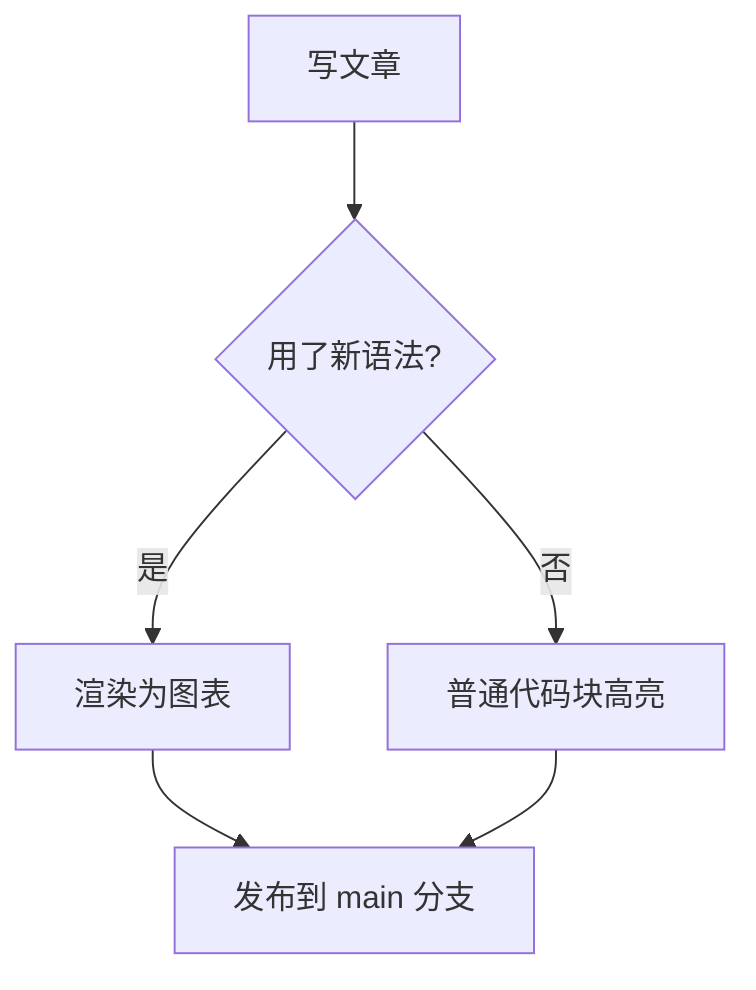
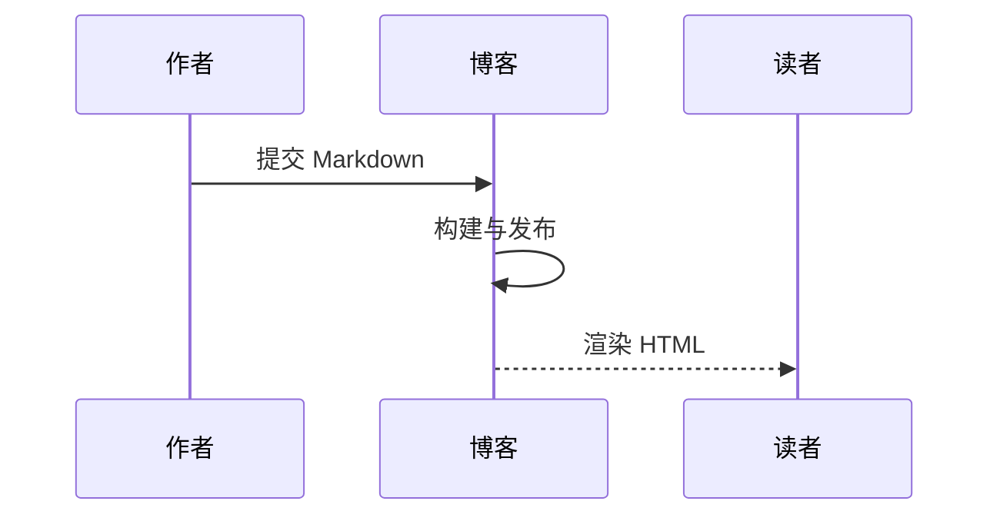

本文是 ink 写作能力的**验收样文**，并附带模板层能力（分享、相关文章、双链等）。


文内双链示例：[[关于我]]。

## 提示块（admonitions）

用 `:::` 包裹内容即可生成彩色提示块，支持五种类型，各自有独立的颜色与图标：

:::note
高亮读者需要留意的信息，即使只是扫读也该看到。
:::

:::tip
可选信息，帮助读者更顺利地使用。
:::

:::important
读者成功所需的关键信息。
:::

:::warning
需要立即注意的潜在风险内容。
:::

:::caution
某个操作可能带来的负面后果。
:::

标题可以自定义：

:::note[提示块的标题可以自定义]
默认标题显示类型名（Note / Tip 等），用 `:::类型[标题]` 可以覆盖。块内支持完整的 Markdown：**加粗**、`行内代码`、列表与代码块。
:::

## Mermaid 图表





## 阅读时间、公式与目录

文章页显示「约 N 字 · 阅读约 M 分钟」（构建期计算）。行内公式 $E=mc^2$，块级公式：

$$\int_0^1 x^2 \, dx = \frac{1}{3}$$

长文自动生成目录卡（与头图并排）；标题 hover 显示 `#` 锚点。

## 通用链接卡片

::card{type="link" url="https://twilightrain.com/about/" title="关于本站" desc="个人介绍与站点说明"}

## GitHub 仓库卡片

::card{type="github" repo="TwilightRainDev/TwilightRain" desc="本博客源码仓库"}

::card{type="github" repo="hexojs/hexo" desc="Hexo 博客框架"}

## 标签页 tabs

:::tabs
--- 写法
在 Markdown 里用 `:::tabs` 与 `--- 标题` 分隔子页。
--- 效果
点击按钮切换面板，默认激活第一个。
:::

## 文内照片墙

:::grid[2]


:::

## 隐藏与折叠（推荐 `:::fold`）

:::fold[text 悬停或点击查看剧透]
这是 `:::fold[text]` 行内揭示块，适合短剧透或答案。
:::

:::fold[details 展开详细说明]
`:::fold[details]` 是统一的块级折叠容器，支持 **Markdown** 与列表。
:::

## 文内时间线（Butterfly 批一）

:::timeline[写作特性演进]
--- Reimu 批一
段落锚点、懒加载、代码折叠、文章时效
--- Butterfly 批一
timeline / btn·label
--- Butterfly 批二
B 站嵌入
--- Butterfly 批三
站点卡、系列文
:::

## B 站懒嵌入（Butterfly 批二）

::bilibili{id="av170001"}

## 系列文目录

本篇 front matter 含 `series: 写作特性验收`，文内 `::series` 会输出系列目录（当前仅一篇，作展示）。

::series


## 代码块复制与超长折叠

下方为 45 行占位代码，应出现「展开全部」按钮且预览区可见正文开头（非空列对行号）。

```javascript
// fold-demo line 01
// fold-demo line 02
// fold-demo line 03
// fold-demo line 04
// fold-demo line 05
// fold-demo line 06
// fold-demo line 07
// fold-demo line 08
// fold-demo line 09
// fold-demo line 10
// fold-demo line 11
// fold-demo line 12
// fold-demo line 13
// fold-demo line 14
// fold-demo line 15
// fold-demo line 16
// fold-demo line 17
// fold-demo line 18
// fold-demo line 19
// fold-demo line 20
// fold-demo line 21
// fold-demo line 22
// fold-demo line 23
// fold-demo line 24
// fold-demo line 25
// fold-demo line 26
// fold-demo line 27
// fold-demo line 28
// fold-demo line 29
// fold-demo line 30
// fold-demo line 31
// fold-demo line 32
// fold-demo line 33
// fold-demo line 34
// fold-demo line 35
// fold-demo line 36
// fold-demo line 37
// fold-demo line 38
// fold-demo line 39
// fold-demo line 40
// fold-demo line 41
// fold-demo line 42
// fold-demo line 43
// fold-demo line 44
// fold-demo line 45
```

## 模板层能力（无需正文语法）

- **分享**：版权声明下方微博 / QQ / X 链接（`post.ejs`）
- **相关文章**：文末按标签交集推荐（本篇标签「博客」「写作」）
- **双链**：文首与文末「链接到 / 反向链接」区块

:::important
验收通过标准：上述块级语法均渲染为对应 DOM 类名；交互类（hide、tabs、代码折叠、B 站占位）可无控制台错误地响应点击/滚动。
:::
