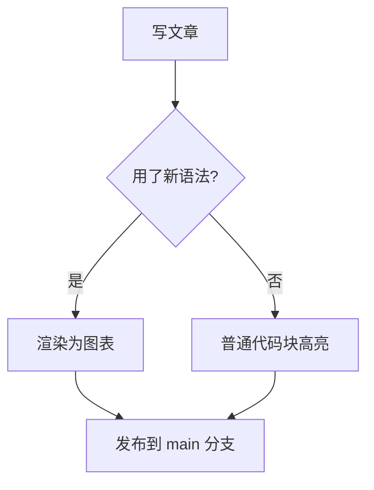
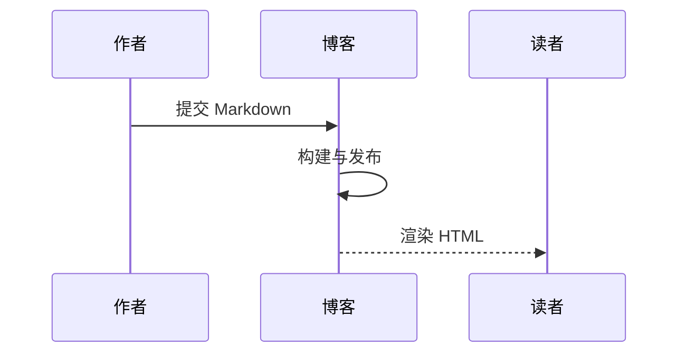

博客的写作系统最近迎来一次更新（Twilight 模板第一批迁移），新增了三项对技术写作比较实用的能力：**彩色提示块**、**Mermaid 图表**与**阅读时间**。本文用实际效果演示它们的写法。


## 提示块（admonitions）

用 `:::` 包裹内容即可生成彩色提示块，支持五种类型，各自有独立的颜色与图标：

:::note
高亮读者需要留意的信息，即使只是扫读也该看到。
:::

:::tip
可选信息，帮助读者更顺利地使用。
:::

:::important
读者成功所需的关键信息。
:::

:::warning
需要立即注意的潜在风险内容。
:::

:::caution
某个操作可能带来的负面后果。
:::

标题可以自定义：

:::note[提示块的标题可以自定义]
默认标题显示类型名（Note / Tip 等），用 `:::类型[标题]` 可以覆盖。块内支持完整的 Markdown：**加粗**、`行内代码`、列表与代码块。
:::

对应的写法：

````markdown
:::warning
这是一条警告。
:::

:::tip[我的标题]
自定义标题的提示。
:::
````

## Mermaid 图表

用 mermaid 语言围栏代码块直接画图，构建时无需任何操作，页面加载时自动渲染为 SVG：



时序图同样支持：



图表会跟随博客的深色/浅色主题切换自动重渲染。语法出错时页面会显示错误信息并保留原始代码，方便排查。

## 阅读时间

文章页正文右上角会显示「阅读约 N 分钟」，按正文文本量估算（约 400 字/分钟），构建期计算完成，不消耗前端资源。

## 其他已有能力

顺带说明几项更早落地的写作能力：

- **MathJax 公式**：行内公式如 $E = mc^2$，显示公式如

$$\int_0^1 x^2 \, dx = \frac{1}{3}$$

  均支持，且按需加载——只有含公式的页面才加载公式库，普通页面零负担
- **代码块一键复制**：所有代码块右上角有复制按钮，点击即复制完整代码（含多行）
- **自动目录**：长文章自动生成目录卡，与头图并排，滚动高亮当前章节

## GitHub 仓库卡片

技术文章里引用仓库时，用单行指令插入仓库卡片：

::github{repo="TwilightRainDev/TwilightRain" desc="本博客源码仓库"}

::github{repo="hexojs/hexo" desc="Hexo 博客框架"}

卡片由构建期静态渲染（仓库名、描述、链接），页面加载后前端从 GitHub API 补充 stars / forks / 语言 / 协议等动态数据（localStorage 缓存 1 小时防限流，请求失败时静默保留静态内容），点击跳转仓库页。

## 使用建议

提示块与 Mermaid 的语法已同步进博客写作规范。一句话总结：

:::important
技术文章里的重点提示用 `:::warning`，流程图直接用 mermaid 围栏，公式用 `$$` 包裹。
:::
