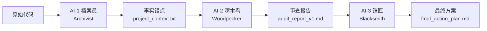
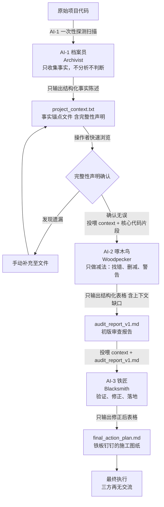

> 三个智能体，各司其职，之间不允许对话，听起来像职场宫斗，但这确实是我最近在用的代码审查工作流。

如果你也经历过这种场景，让同一个 AI 既当找 bug 的、又当修 bug 的、还当审核的，最后它自己推翻自己，在同一个对话里反复横跳，那这篇文章可能对你有用。

## 背景：我为什么受不了了

有段时间我一直在和 AI 对话写代码，就是那种「我出想法、AI 写实现」的 Vibe Coding 模式。听起来挺高效的对吧？

但实际操作起来有个很烦的问题：

同一个 AI 对话窗口里，我说「帮我看一下这段代码有什么 bug」。它列了五条。然后我说「那你改一下吧」。它改了，但改完之后自己又把其中两条「我刚刚说的其实也没那么严重」给推翻了。我再追问一句，它又开始往回找补，最后整个对话变成了一场 AI 和自己的辩论赛。

左脑搏击右脑，毫无生产力。

这个问题不是偶然的。LLM 的本质是对话模型，它的回答天然倾向于**调和矛盾、保持一致性、尽量不得罪用户**。你让它检查 bug，它查了。你让它反过来质疑自己查到的 bug，它大概率会说「你说得对，这里可能确实没那么严重」。

这不是 AI 笨，这是它的**天性**，它被训练成以对话者为中心。

那怎么办？我的答案是：**不给它对话的机会**。

## 设计思路：流水线化与角色固化

我参考了制造业质量管理里的一个经典概念，**质量门禁**（Quality Gate）。在生产线上的每个关键节点设一道门，原材料进、成品出，中间单向流动，不允许逆流。

那么对于 AI 代码审查，我也设了三道门。三扇门后面站着三个 AI，每个有且只有一个角色，角色之间**不对话、不辩论**。

每个角色只做一件事，做完就输出一份确定的文档，然后**切断对话**，把这份文档原封不动地喂给下一个角色。

我把这个方法叫做 **三子智能体单向质量门禁法**（Triple-AI One-Way Quality Gate）。

下面展开说这三个角色的分工。

## 第一阶段：AI-1 档案员

角色名字叫 Archivist，档案员。它的工作异常简单，**什么也不分析，只收集事实**。

输入是一堆源代码。

输出是一份叫 `project_context.txt` 的结构化文档，内容包括：目录树、项目元信息、配置文件全文、入口文件全文、核心源文件清单，以及一个上下文完整性声明。

### 它不做什么

- 不评价代码质量
- 不分析架构
- 不提出任何建议
- 不使用任何推测性词汇（「看起来」「似乎」「可能」「或许」「感觉」，全部禁止）

### 它做什么

全量扫描目录树，然后自动发现并读取以下几类文件：

- **配置文件**：package.json、tsconfig.json、Dockerfile、.env.example 等
- **入口文件**：从 package.json 的 main/bin/exports 字段定位，找不到就按惯例搜
- **核心源文件**：沿 import 链读取直接依赖的核心模块（不超过 3 层、10 个文件）

如果文件不存在，如实写「该文件不存在」。不解释原因，不脑补内容。

输出文档的最后一节是一张**完整性声明表**，坦承这个文件覆盖了项目多大比例、哪些类别的文件被收录、有没有已知的遗漏。遗漏处留空，由人工判断是否需要补充。

### 为什么要有这道工序

因为 AI 的「分析」经常建立在错误的事实基础上。它可能猜错了你的目录结构、记混了你的配置文件、或者编造了一个不存在的依赖。**先让一个角色纯粹地确认事实**，后续的分析才不会在沙上建塔。

输出之后，窗口 A 关闭。

## 第二阶段：AI-2 啄木鸟

角色叫 Woodpecker，啄木鸟。它是**极端悲观主义者**，只做减法，只找错。

输入是 `project_context.txt` + 核心代码片段。它不看原始项目目录，它只认档案员给的事实锚点。

### 审查维度

审查分为四个级别：

| 级别 | 含义 | 示例 |
|------|------|------|
| **Error** | 未捕获异常、安全漏洞、版本不兼容 | `src/api.ts L45 — 未对用户输入 name 做转义，直接拼入 SQL` |
| **Risk** | 内存泄漏、硬编码密钥、圈复杂度 >10 的函数 | `utils/handler.ts L120 — setInterval 未存储返回值，页面卸载时未清除` |
| **Redundancy** | 未使用的依赖/变量、重复度超过3次的代码块、过时的 Polyfill | `package.json — lodash 仅使用了 _.get 方法，可改用可选链` |
| **上下文缺口** | AI-1 遗漏的关键文件（兜底补偿） | `src/middleware/auth.ts — 文件存在于目录树但未被 AI-1 收录，其 verifyToken 被多处路由引用` |

输出格式是一张严格的结构化表格，有级别、文件路径、行号、现象描述、建议修正动作。依然是**无开场白、无废话、无模糊评价**。

值得一提的是「上下文缺口」这个维度，啄木鸟在审查开始前，会基于目录树检查有没有「存在但未被收录」的关键文件。发现缺口不会阻塞审查，而是如实列出，由人工决定是否补喂。这是一个人机协作的兜底机制。

输出之后，窗口 B 关闭。

## 第三阶段：AI-3 铁匠

角色叫 Blacksmith，铁匠。它是**极端实用主义者**，不评价啄木鸟的智商，只拿着一份报告去对照真实代码，能做就做，做不了就改。

输入是 `project_context.txt` + `audit_report_v1.md`。

### 三条验证准则

| 准则 | 含义 | 处理方式 |
|------|------|----------|
| **妥适性** | 建议删除的代码是否真的未被别处引用？ | 若被引用，直接删除该条目，不废话 |
| **准确性** | 建议的行号是否精确？ | 不精确则直接修正 |
| **可落地性** | 建议是否受限于框架版本？ | 重写该条目的修正动作，使其兼容当前环境 |

输出是 `final_action_plan.md`，格式和啄木鸟的报告完全一样。

### 语气约束（强制注入）

我给铁匠设了一段不可绕过的 System Prompt，重点只有一句话：

> **禁止展示思考过程、对比过程或发现错误的过程。只输出最终的修正结果。**

这意味着铁匠看到「AI-2 说这里要删某行」，对照代码发现那行另有引用，它不会说「等等，这里不对，AI-2 你搞错了」，它只是静默地把那条条目从表格里删掉，直接输出修正后的表格。

矛盾处理遵循**最小改动原则**：如果两条建议冲突（比如一个建议删文件、另一个建议改该文件），保留改动最小的那条，删除改动大的那条。

## 完整工作流示意图

## 实际操作：如何避免左脑搏击右脑

一开始我用的是三个连续 Prompt 的写法，同一个对话窗口里依次让 AI 扮演档案员、啄木鸟、铁匠。效果有，但不够干净。

因为 AI 记得它上一轮扮演过档案员、写过哪些文件、发现了什么问题。到铁匠那一步，它天然地放水，「这条是我自己（作为啄木鸟时）写的，应该没问题吧」。

第一次迭代是：**开三个独立的对话窗口。**

| 窗口 | 角色 | 操作 |
|------|------|------|
| 窗口 A | 档案员 | 执行完毕 → 提取 `project_context.txt` → **关闭窗口 A** |
| 窗口 B | 啄木鸟 | 粘贴 `project_context.txt` 作为输入 → 输出报告 → **关闭窗口 B** |
| 窗口 C | 铁匠 | 粘贴 `project_context.txt` + `audit_report_v1.md` 作为输入 |

关掉窗口意味着物理上切断记忆。新的窗口没有之前的上下文，AI 不知道啄木鸟是谁、档案员是谁、它自己上一轮说过什么。它只能对着当前的事实锚点和报告条目逐一验证。

这听起来有点笨拙，但实际用下来效果确实好。**上下文隔离是阻止 AI 自我推翻最有效的手段**，没有之一。

第二次迭代：在子智能体协作模式下，上下文隔离是内置设计，无需人工干预。三个智能体各自运行于独立的、无状态的会话中，彼此不共享任何历史记忆，每一次调用都如同首次见面。数据流由编排层自动驱动，每个智能体完成自己的输出后，其会话即被销毁，下一个智能体只能看到上游产出的文档，而无法感知之前的对话过程。

| 智能体 | 角色 | 操作 |
|--------|------|------|
| 智能体 A | 档案员 | 执行完毕，生成 `project_context.txt`，自动触发智能体 B |
| 智能体 B | 啄木鸟 | 读取 `project_context.txt` 作为输入，输出 `audit_report_v1.md`，自动触发智能体 C |
| 智能体 C | 铁匠 | 读取 `project_context.txt` + `audit_report_v1.md` 作为输入，输出最终方案 |

这套流程不再需要人工开三个窗口、手动关闭。智能体之间的衔接由流水线调度器完成，每个智能体以无状态函数的方式被调用，上下文天然隔离。而在子智能体协作模式里，它不再是笨拙的权宜之计，而是架构层面的原生特性。

## 用了几次之后的感受

目前这个工作流我主要用在项目代码审查和大型重构的预检阶段。说几个实际体感：

**档案员是最容易被低估的角色。** 很多人觉得「扫描目录+读文件」没什么技术含量，直接让 AI 一步到位审查不就行了。但事实是，缺少这一步，啄木鸟的分析经常建立在对代码结构一知半解的基础上。有了事实锚点，后面两阶段的产出质量明显更稳定。

**上下文缺口这个兜底机制有用。** 档案员扫描目录时，可能因为文件过多或者规则限制，漏掉了某些关键文件。啄木鸟从目录树里发现这些缺口并列出，至少让人知道自己「不知道什么」，这比盲审要好得多。

**铁匠的角色定位是关键创新。** 大多数代码审查工具只做「检查→报告」两步。加入一个「验证→修正」的第三阶段，并且强制这个阶段**不输出解释、只输出结果**，有效地过滤掉了 AI 自己的错觉和过度报告。

## 总结

三子智能体单向质量门禁法的核心就三点：

1. **角色固化**，每个 AI 只做一件事，不跨界
2. **单向数据流**，上游输出 = 下游输入，没有反馈回路，禁止对话
3. **上下文隔离**，物理上切断记忆窗口，让 AI 无法自我推翻

如果你也在用 AI 做代码审查，不妨试试这个模式。不一定需要三个角色完全照搬，但「**把它拆成独立步骤，每一步只做一件事，切掉对话回路**」这个思路，应该是通用的。

方法总比解法多。尤其是在和 AI 协作这件事上，我觉得与其抱怨 AI 不靠谱，不如想想怎么设计流程，让它不靠谱的部分够不到终点线。